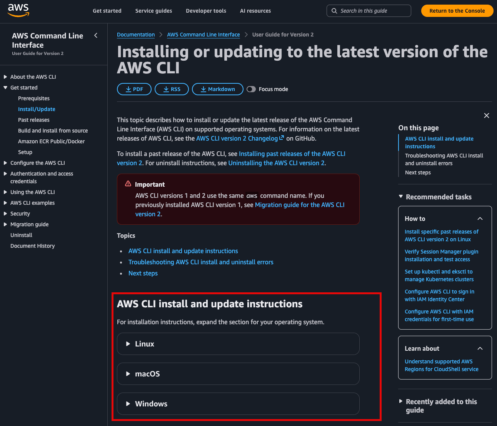

## SIADS 699 - Module 1: Download Setting up the Root User
One person on the team will be the "Root User." This person's responsibilites will include:
* Setting up the team's AWS accounts.
* Maintaining responsibility for billing (ie you will supply your own credit card)
* Managing access for your team's access and roles.

Whoever chooses to do this on your team doesn't need to be familiar with the cloud, but they should be excited about using it. 

### Visual Follow Along
This [Youtube Video](https://youtu.be/NhDYbskXRgc?si=wYFAvPrt7RrC4fX-&t=4775) (from 1:19:34 - 1:30:00) does a good job explaining the root user role, and how to set up other accounts with limited access.

### Pre-Requisites
Before getting started you need the following:
* An email address (your @umich.edu account will not be accepted by AWS)
* A credit card
* Be sure to run these steps on your personal laptop, there's no guarantee this will work on a laptop from work. 

Also assuming this is your first time connecting AWS to your local VS code you'll need to download the AWS CLI interface from here:
* https://docs.aws.amazon.com/cli/latest/userguide/getting-started-install.html?

### Setting up your AWS account
1. Go to https://aws.amazon.com/console/
2. Click the Create Account button
3. Enter your email
4. It's optional, but I recommend assigning an account name. Something like `umich-capstone-YOURLASTNAME` is a good one. 
5. Set up a password.
6. Opt for the free plan.
7. Supply your credit card info
8. If they ask for a support plan, opt for the free version.
9. Congrats! You have now successfully set up the root user role. 

### What's next
In the [next module](https://github.com/chrismca13/aws-demo/tree/main/2_setting_up_the_admin_role) we will:
* Tell you how to set up an `admin` role for you to work from.
* Talk through how to set up roles with limited access for your teammates.